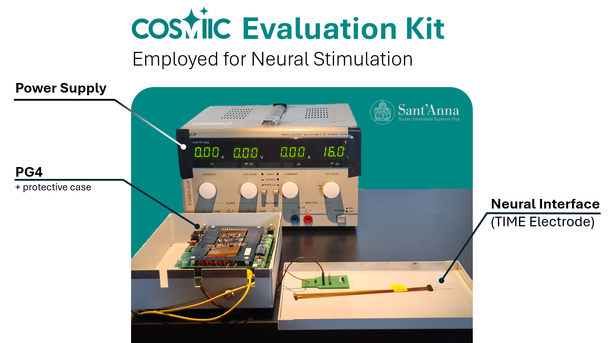
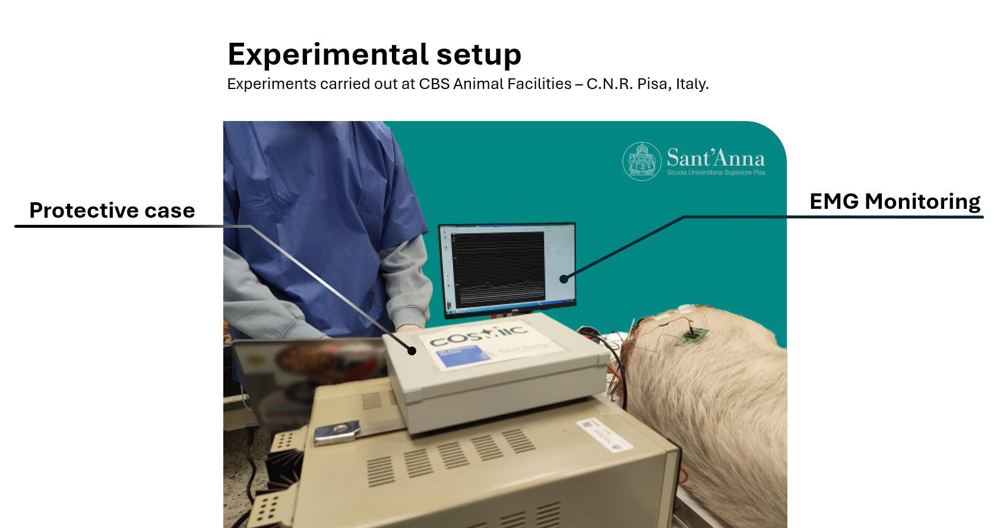
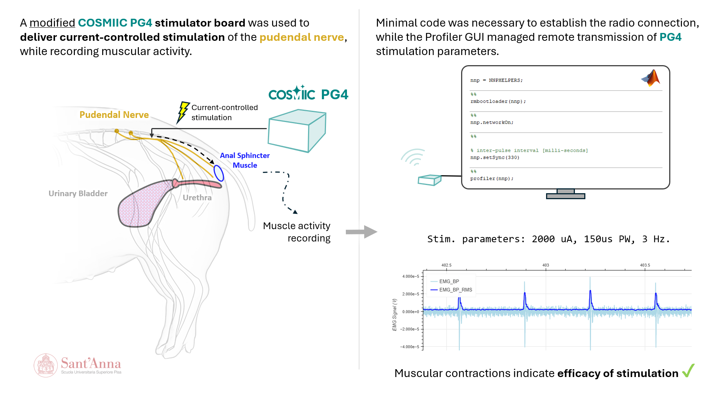

# Example Projects

Who is using the device already?

---

## Translational Neuro Engineering Lab at Scuola Superiore Sant'Anna

While the PG4 stimulation output was originally designed for muscular stimulation (relatively high stimulation thresholds), the team at the Translational Neuro Engineering Lab at Scuola Superiore Sant'Anna customized their PG4 module specifically for new peripheral neuromodulation applications requiring lower output and finer amplitude control. They are now employing the COSMIIC System in a variety of animal experiments. More on the modification of the PG4 on [**this forum post.**](https://community.cosmiic.org/t/reducing-stimulation-amplitude-with-resistor-swap/36)

The modified PG4 was used in a preliminary animal experiment to test its performance in vivo. The experiment involved stimulating the pudendal nerve of a pig (*Sus Scrofa Domesticus*) and recording the resulting muscle activity of the External Anal Sphincter. The stimulation was delivered through a TIME (Transverse Intrafascicular Multichannel Electrode). The Electromyographic (EMG) signals were recorded using needle electrodes placed percutaneously in the muscle.

Preliminary results showed the ability to evoke muscle activity with the modified PG4.

Further experiments are needed to fully characterize the performance of the modified PG4 as compared to standard stimulation devices.

---

