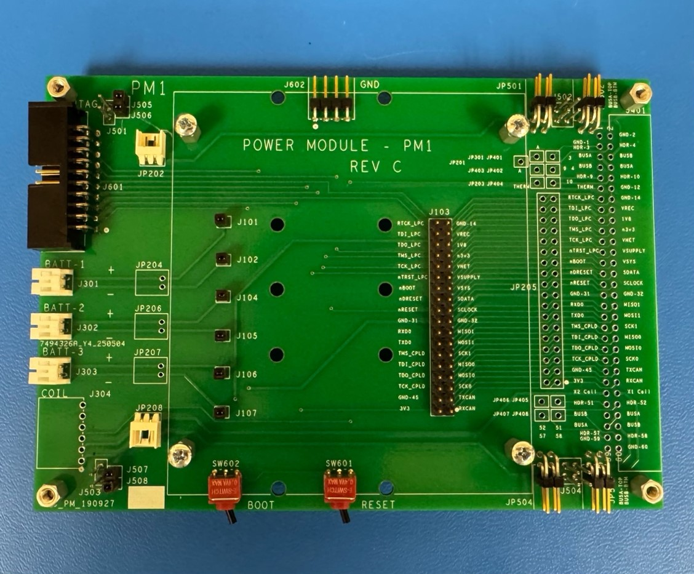
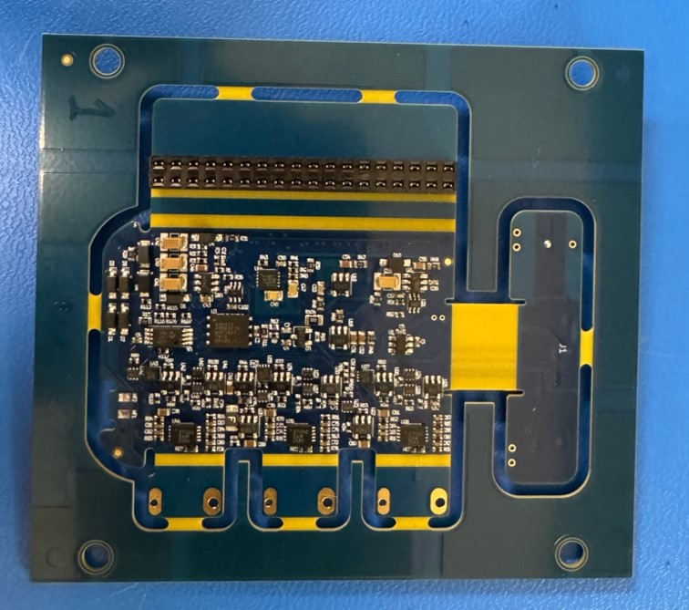
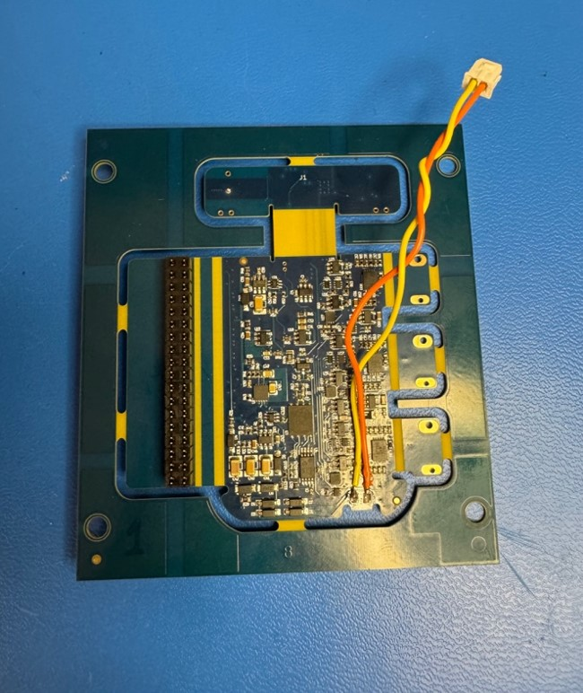
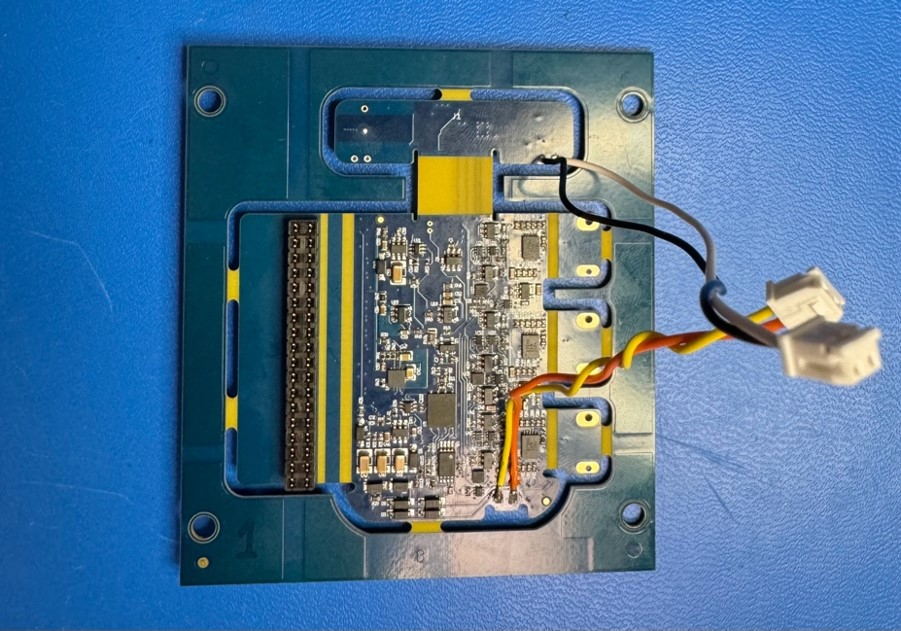
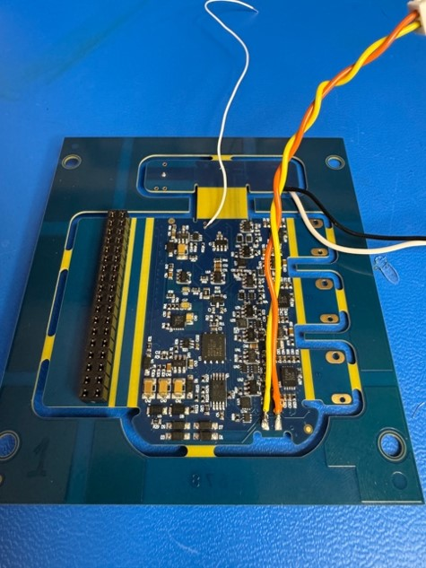
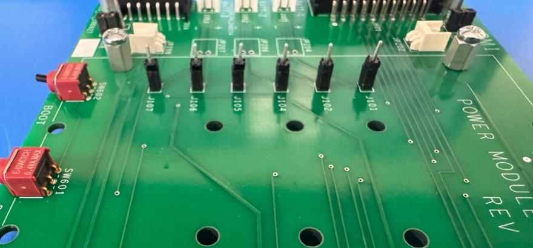
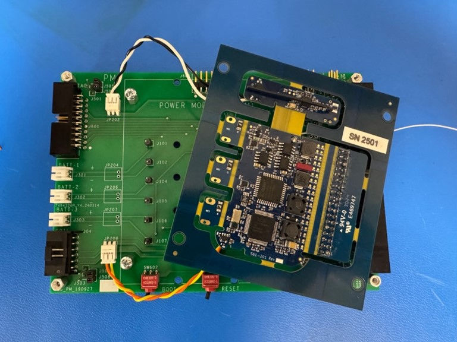
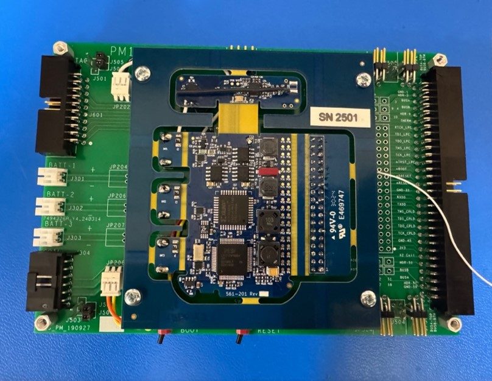
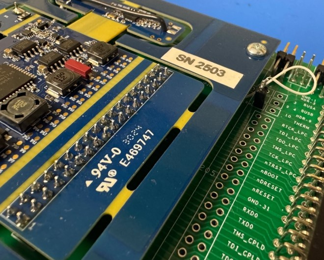

# Development Kits Fabrication

BYO-DK (build your own dev kit)

---

## Development Board Files

Files, drawings, and a comprehensive BOM of all 3 frame boards for the PM1C, PG4D, and BP2C are available on the COSMIIC Githube here: 
:link: [DevelopmentKits-Hardware on COSMIIC GitHub](https://github.com/COSMIIC-Community/DevelopmentKits-Hardware)

---

## Development Board Assembly Steps

### Power Module (PM) Dev Board Assembly

#### Assembly of Frame Board

The frame board has several parts that are first populated onto the board. Each part that is to be soldered on has its associated part name already engraved onto the board. The order of the components soldered on need not matter, so long as they are in the right spot.

Figure 3.1: A Power Module Frame Board with proper population of components

#### Assembly of the Circuit Board onto Frame Board

To successfully attach the circuit board onto the frame boards, the steps do matter. They are listed in order below.

1. Solder the J103 Male Connector into the labeled J103 slot onto the frame board. Ensure that the silver-colored pins are the side that go down through the frame board. Refer to Figure 3.1 to see proper attachment of J103.

2. Solder the J103 Female Receptable onto the J103 slot on the PM circuit board with the silver pins sticking to the top of the board and the gold receptacles on the bottom side of the board. The bottom side is considered the face without the serialized sticker name of the board.

   

   Figure 4.1: A correct faced connection of the J103 Female Receptable

3. Connect the JP208 Mate with the associated JP208 Orange and JP208 Yellow wires. Ensure the prong side of the mate is faced up and, in this orientation, connect the orange wire on the left side and the yellow wire on the right side of the mate. A click can be heard between the wires and the mate to confirm an adequate connection. Twist the two wires loosely to improve cable-management in later assembly steps. Additionally, cut the ends of each wire to around 1/16 of an inch. Then, solder the orange wire onto the NF1 region and the yellow wire onto the NF2 region that are both adjacent to one another on the bottom of the PM board.

   

   Figure 4.2: A proper connection of JP203 and the two associated wires

4. In a similar manner, connect the JP202 Mate with the associated JP202 Black and JP202 White wires. Ensure the prong side of the mate is faced up and, in this orientation, connect the black wire on the left side and the white wire on the right side of the mate. Twist the two wires and cut the ends of each of them to around 1/16 of an inch. Plug the JP202 Mate into the JP202 slot on the frame board. On the back side of the circuit board, there are two holes that sit on the right, header section; the white wire is soldered into the outside hole and the black wire is soldered into the inside hole.

   

   Figure 4.3: A proper connection of JP203 and the two associated wires

5. Solder a JP202 (30-gauge) White wire to the more central RM hole that is on the bottom of the circuit board.

   

   Figure 4.4: A proper connection of the 30 Gauge Wire

6. Connect the J101 to J107 Male connectors to their respective slots in the frame board with the silver side sticking upwards and the gold side into the receptacle.

   

   Figure 4.5: The orientation for the J101 to J107 Male Connectors

7. Connect the JP202 and JP208 Mates on the circuit board onto their associated slots on the frame board.

   

   Figure 4.6: The initial connection between the Circuit and Frame Board

8. Take off the screws on the frame board. Simultaneously, connect the J101-107 Male connectors and the J103 Female Receptable so that the frame board and PM circuit board interconnect. Solder the J101 to J107 Female Receptacle components onto the PM Circuit Board for more security.

   

   Figure 4.7: The full connection between the Circuit and Frame Board

9. Solder a JP203 Male connector into the THERM spot on the frame board, ensuring the silver side faces down. Connect a JP203 Female Receptacle onto the male. Now, solder the 30-gauge White wire on.

   

   Figure 4.8: A proper THERM and 30-Gauge White wire connection

---

### Biopotential Amplifier (BP2) Dev Board Assembly

Figure 1: Top Side of Assembled BP Frame Board.

Figure 2: Bottom Side of Assembled BP Frame Board.

Figure 3: Assembled BP Frame Board with BP Implant Board Connected

Assembly Instructions:

A particular order of assembly is not essential, but some components are easier to put on first. For most components on this list, it helps to tape the component down tightly so the board can be flipped over for soldering. All components are referenced by their number on the BOM for this board which can be seen in Figure 4 at the end of this document.

Components #10 and #11 are the inter-board connectors that will allow multiple Evaluation boards to stack together. The easiest way to assemble these is by using another Evaluation board as reference for proper alignment. If a previously assembled Evaluation board of any type (PM, PG, BP) is not available, then this board should be done carefully and used as a reference for any further boards in your stack to ensure they can all connect (stack) properly.

Recommended Order of Assembly:
#: 10/11, 4, 19, 9, 22, 20, 18, 24, 21(3x), 14, 13, 25, 18-1, 18-2, 29/30, 31(2x), 19-1

Individual Notes on Assembly:

`#10/11`
- These components should go on first as they are essential for the board stacking and communicating properly with other Evaluation Boards.
- IF you have an existing assembled Evaluation board:
  - Connect the female end of all 4 connectors (2 #10 and 2 #11) to your existing assembled Evaluation board. Now take your new empty board and set it on top so that the male pins of all 4 connectors stick out on the top side of the board (Figure 1). This will allow you to easily solder the new connectors on from the top side of the board.
- IF you do not have an existing assembled Evaluation board:
  - Put all 4 connectors (2 #10 and 2 #11) through the Evaluation board so the male pins stick out of the top side (Figure 1). Lay the board down top side up so that it is propped up by the female ends of the 4 connectors. A flat surface will help during careful soldering to ensure alignment is not disturbed.

`#4`
- 2x2 right angle header. It's important that the connector is fully seated and square to the board.

`#19`
- Place connector with silver pins. The shorter gold pins should face up on the top side of the board.

`#18`
- Match notch of component to silkscreen on board.

`#21`
- Place all 3 colors of this component on the board and tape down together for faster assembly.

`#29/30/31`
- These components are screws and spacers for either spacing between two Evaluation board or for the implant board attachment.The 3/16" screws are used to mount the implant board spacers onto the Evaluation board. The 1/8" screws are used to screw the implant board into place from the top side. A F/F standoff (#30) is used for this.
- The M/F (#29) standoff connects to a F/F (#30) standoff for the outer board spacers. The M/F standoff goes in from the bottom side of the board.

`#19-1`
- This component is last in the assembly since it should be soldered to the actual implant board and not the Evaluation board. Connect the female end of this connector to the gold pins of connector #19.
- After this is connected, the implant board can sit on the male pins of this connector and be secured into place by the four screws on top of spacers on the top side of the board. See Figure 3 for example.
- Once this is complete this component can be soldered to the implant board.

Figure 4: Populated Board with BOM number references for components.

---

### Pulse Generator (PG4) Dev Board Assembly

Figure 1: Top Side of Assembled PG Frame Board.

Figure 2: Bottom Side of Assembled PG Frame Board.

Figure 3: Assembled PG Frame Board with PG Implant Board Connected

Assembly Instructions

A particular order of assembly is not essential, but some components are easier to put on first. For most components on this list, it helps to tape the component down tightly so the board can be flipped over for soldering. All components are referenced by their number on the BOM for this board which can be seen in Figure 4 at the end of this document.

Components #10 and #11 are the inter-board connectors that will allow multiple Evaluation boards to stack together. The easiest way to assemble these is by using another Evaluation board as reference for proper alignment. If a previously assembled Evaluation board of any type (PM, PG, BP) is not available, then this board should be done carefully and used as a reference for any further boards in your stack to ensure they can all connect (stack) properly.

Recommended Order of Assembly:
#: 10/11, 4, 16, 15, 19, 9, 22, 20, 18, 21(3x), 14, 13, 18-1, 18-2, 29/30, 31(2x), 19-1

Individual Notes on Assembly:

`#10/11`
- These components should go on first as they are essential for the board stacking and communicating properly with other Evaluation Boards.
- IF you have an existing assembled Evaluation board:
  - Connect the female end of all 4 connectors (2 #10 and 2 #11) to your existing assembled Evaluation board. Now take your new empty board and set it on top so that the male pins of all 4 connectors stick out on the top side of the board (Figure 1). This will allow you to easily solder the new connectors on from the top side of the board.
- IF you do not have an existing assembled Evaluation board:
  - Put all 4 connectors (2 #10 and 2 #11) through the Evaluation board so the male pins stick out of the top side (Figure 1). Lay the board down top side up so that it is propped up by the female ends of the 4 connectors. A flat surface will help during careful soldering to ensure alignment is not disturbed.

`#4`
- 2x2 right angle header. It's important that the connector is fully seated and square to the board.

`#16`
- The surface mount diodes are polarized. Place the line or stripe side on the left in reference to Figure 1.

`#15`
- Bend the LEDs such that that it can face perpendicular to the board as seen in Figure 1. The remainder of the lead on the bottom edge of the board can be snipped off.

`#19`
- Place connector with silver pins. The shorter gold pins should face up on the top side of the board.

`#18`
- Match notch of component to silkscreen on board.

`#21`
- Place both 2 colors (4 red, 1 black) of this component on the board and tape down together for faster assembly.

`#29/30/31`
- These components are screws and spacers for either spacing between two Evaluation board or for the implant board attachment.The 3/16" screws are used to mount the implant board spacers onto the Evaluation board. The 1/8" screws are used to screw the implant board into place from the top side. A F/F standoff (#30) is used for this.
- The M/F (#29) standoff connects to a F/F (#30) standoff for the outer board spacers. The M/F standoff goes in from the bottom side of the board.

`#19-1`
- This component is last in the assembly since it should be soldered to the actual implant board and not the Evaluation board. Connect the female end of this connector to the gold pins of connector #19.
- After this is connected, the implant board can sit on the male pins of this connector and be secured into place by the four screws on top of spacers on the top side of the board. See Figure 3 for example.
- Once this is complete this component can be soldered to the implant board.

Figure 4: Populated Board with BOM number references for components.
