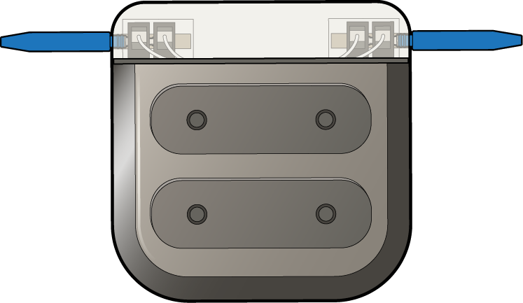

# Nova - High-Density Array Module

64-channel or 32-channel versatile array module (N32)

---

## Component Overview

The Nova module (formerly known as HIVE) is an implantable module designed to provide high-channel-count capabilities that integrate with the broader COSMIIC System. The Nova module is available in two configurations using the same form factor: a **32-channel stimulation module** and a **64-channel recording module**, giving users the flexibility to record neural signals or deliver stimulation through a high-density electrode interface. Currently, the 64-ch recording module is reaching completion and the 32-ch stimulation module is in a beta stage.

The NOVA initiative is a collaboration between teams at Case Western Reserve University and the University of Michigan, spanning electronics design, mechanical engineering, regulatory affairs, and COSMIIC System integration. The project is supported by the NIH SPARC HORNET Initiative (Award 1U41NS129436-01). **All design files are released under the Creative Commons Attribution 4.0 (CC-BY-4.0) license.**

---

## Technical Overview

The Nova module is designed to interface with high-density electrode arrays and communicate within the COSMIIC implanted network via the FESCAN power and communication protocol. Both module configurations use a titanium enclosure compatible with the NNP network and support hard-wired or in-line connector electrode interfaces.

The module measures 35.8 × 36.6 × 9.4 mm and is built around the Intan RHD2164 bioamplifier, supporting sampling rates up to 30 kSps, a lower cutoff frequency of 0.1–500 Hz, an upper cutoff frequency of 100 Hz–20 kHz, and an input-referred noise of 2.4 µVrms at a power consumption of 30 mW when sampling at 2 kSps. Signal processing is handled by an STM32 microcontroller. The PCB uses a two-panel rigid-flex design with configurable feedthrough covers supporting up to 2×32 electrode connections.

---

## Source Files

All source files for the Nova module are available in the COSMIIC GitHub repository:

:link: **[NOVA on COSMIIC GitHub](https://github.com/COSMIIC-Community/NOVA)**

### Mechanical Design and Drawings

Mechanical design files for the 64-channel recording module are available here:

:link: **[NOVA/"64 Channel Recording Module/Design/Mechanical" on COSMIIC GitHub](https://github.com/COSMIIC-Community/NOVA/tree/main/64%20Channel%20Recording%20Module/Design/Mechanical)**

### PCB and Schematics

PCB design files for the 64-channel recording module are available here:

:link: **[NOVA/"64 Channel Recording Module/Design/PCB" on COSMIIC GitHub](https://github.com/COSMIIC-Community/NOVA/tree/main/64%20Channel%20Recording%20Module/Design/PCB)**

### Firmware

:link: **[NOVA/"64 Channel Recording Module/Design/Firmware" on COSMIIC GitHub](https://github.com/COSMIIC-Community/NOVA/tree/main/64%20Channel%20Recording%20Module/Design/Firmware)**

Guidance on the build and flash process are incoming.

### Fabrication

:link: **[NOVA/"64 Channel Recording Module/Fabrication" on COSMIIC GitHub](https://github.com/COSMIIC-Community/NOVA/tree/main/64%20Channel%20Recording%20Module/Fabrication)**

### FDA Communications

:link: **[NOVA/"64 Channel Recording Module/FDA Communications" on COSMIIC GitHub](https://github.com/COSMIIC-Community/NOVA/tree/main/64%20Channel%20Recording%20Module/FDA%20Communications)**

---

## Coming soon

Design files for the 32-channel stimulation module are on their way.
