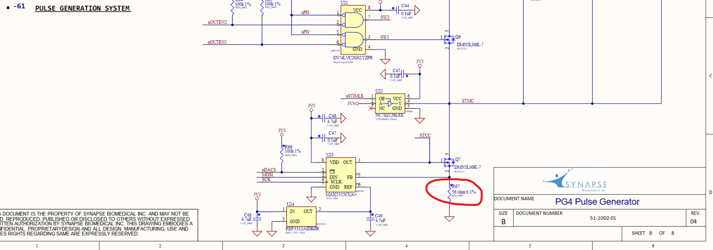
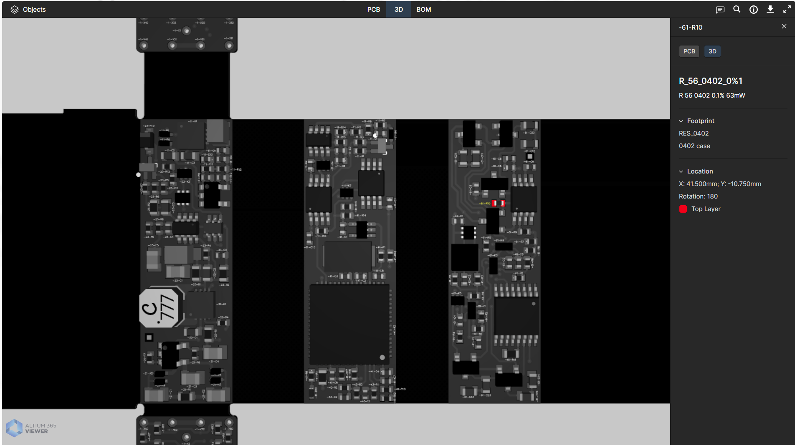

# Reduce Stimulation Amplitude

Swap a resistor on the dev board to lower stimulation amplitude 

---

## Overview

The Micera Lab at Scuola Superiore Sant'Anna is seeking to study several different techniques in animal models. Their neural applications all require lower stimulation and finer resolution than the original use of the COMSIIC System for muscular activation.

### Contributors

- Scuola Superiore Sant'Anna Lab: Silvestro Micera, Filippo Castellani, Francesco Iberite, Alice Gianotti
- COSMIIC team: Jerry Ukwela, Chris Rexroth

---

## Modifications

The goal was to shrink the range of stimulation amplitude from 100uA-20mA at 100uA resolution by a scale of 10 to 10uA-2.0 uA at 10uA resolution 

### Design Thinking

Given the version of PG4 (PG4D) they have and that this change is intended to be permanent, it is easier to approach this issue with a hardware change instead of firmware change. Future versions of the PG4 be more capable for adjusting the amplitude range. 

Take a look at R67 on the stimulation output schematic from our GitHub. This is the circuitry for the PG4. The current output is based on an input voltage divided by that R67. THe current range and resolution will scale inversely with changes made to R67. To scale the current amplitude range down by 10, R67 was swapped with a 56ohm*10 = 560ohm resistor. The next version of the PG4 (version E) will be easier to make firmware changes and use the full resolution of the DAC. That will be ready in about 6 months.

Here is the view of that resistor's location on the pcbdoc viewer. Shown here as R10, it seems one version of the schematic has that resistor as R67 and another as R10. It is still a 56ohm resistor regardless.

### Forks of Repository

There were no modifications made to the firmware or hardware repositories of the modules involved.

---

## Attributions

Supported by the NIH SPARC HORNET program, the Case Western Reserve University team is funded by main award U41NS129436-03 and is interacting with the Scuola Superiore Sant'Anna as an early adopter.