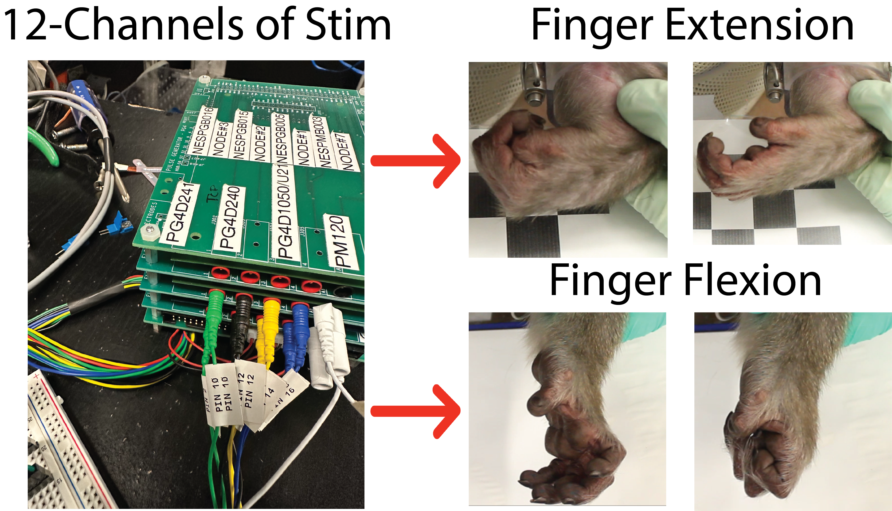
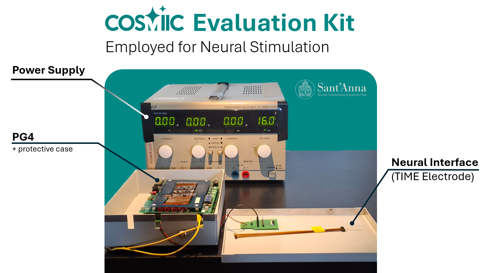
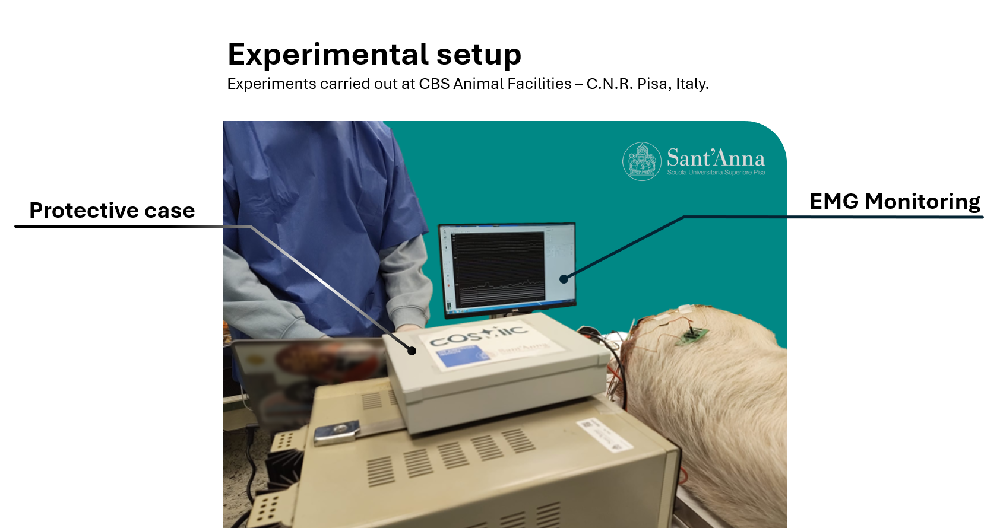
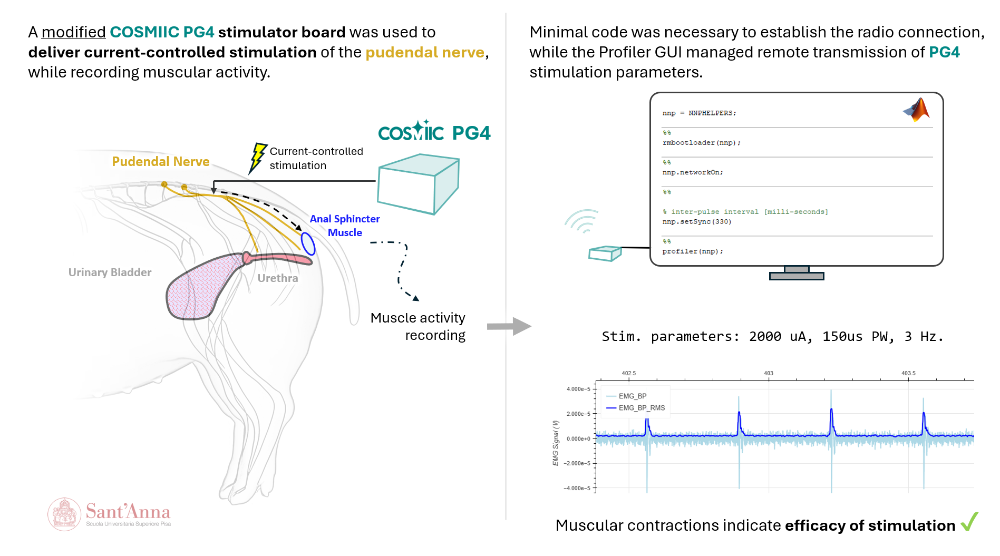

# Example Projects

Who is using the device already?

---

## Cortical Neural Prosthetics Lab at the University of Michigan (Dr. Cindy Chestek)

The Chestek Lab has been using COSMIIC / NNP hardware for many years to conduct experiments on functional electrical stimulation (FES) for the treatment of paralysis. They use nonhuman primates as a model for studying brain computer interfaces, and then use these control signals from motor cortex to drive stimulation of finger and wrist movements. The long term goal is to establish the feasibility of restoring functional hand movements in people.

Their main experimental setup consists of a benchtop development kit with several PG4 boards that is connected to an array of electrode connectors. The system is used with percutaneous intramuscular electrodes implanted in non-human primate models. A computer running MATLAB coordinates the patterns of stimulation for different hand grasp patterns through the COSMIIC System while also triggering separate high-density recording systems.

Dr. Chestek's lab is also contributing a new module into the COSMIIC ecosystem: the Nova, high-density 64-channel recording module. They will be using this device for use in nerve-controlled prosthetics. More about the device can be found here: [**In-Development-Modules/Nova-Module.md**](/docs/In-Development-Modules/Nova-Module.md)

---

## Translational Neural Engineering Lab at Scuola Superiore Sant'Anna (Dr. Silvestro Micera)

While the PG4 stimulation output was originally designed for muscular stimulation (relatively high stimulation thresholds), the team at the Translational Neuro Engineering Lab at Scuola Superiore Sant'Anna customized their PG4 module specifically for new peripheral neuromodulation applications requiring lower output and finer amplitude control. They are now employing the COSMIIC System in a variety of animal experiments. More on the modification of the PG4 on [**this forum post.**](https://community.cosmiic.org/t/reducing-stimulation-amplitude-with-resistor-swap/36)

The modified PG4 was used in a preliminary animal experiment to test its performance in vivo. The experiment involved stimulating the pudendal nerve of a pig (*Sus Scrofa Domesticus*) and recording the resulting muscle activity of the External Anal Sphincter. The stimulation was delivered through a TIME (Transverse Intrafascicular Multichannel Electrode). The Electromyographic (EMG) signals were recorded using needle electrodes placed percutaneously in the muscle.

Preliminary results showed the ability to evoke muscle activity with the modified PG4.

Further experiments are needed to fully characterize the performance of the modified PG4 as compared to standard stimulation devices.
