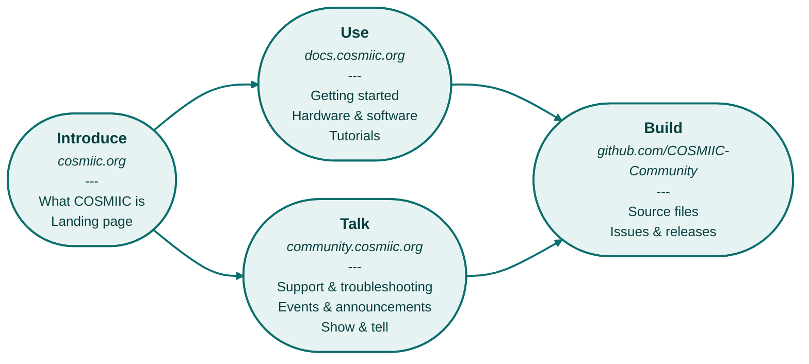

# Welcome to COSMIIC Docs

---

## COSMIIC Sites Map

---

## Overview

- This Documentation site (docs.cosmiic.org) describes and links to all source files of the COSMIIC System that are necessary for benchtop, pre-clinical and human use&mdash;hardware, software, mechanical components, test documents, and regulatory documents.
- The contents of this site are available under terms of CC-BY-4.0. As such, we ask that you provide attribution when referencing this site. This site does not hold any design source files, but does contain example regulatory documents under this license. The single source of truth for COSMIIC System design source files is on GitHub.
- Refer to the **[Licensing](/Community/Licensing)** page to learn about our permissive licensing

---

## Navigating the Docs Site

- Check out the summarized material about COSMIIC System components under the **[Implantables](/category/implantables)** sidebar.
- Using MATLAB to interact with the COSMIIC System? Find the API and apps in the **[MATLAB Interface](/category/matlab-interface)** sidebar.
- Download examples of an existing Investigational Device Exemption (IDE) through the **[Resources -> Regulatory](/category/regulatory)** tabs.
- See who else is using the COSMIIC System in the **[Example Projects](/Resources/ExampleProjects)** page

---

## Get in Contact

- For questions, comments, involvement opportunities, etc., post on the [COSMIIC Forum](https://community.cosmiic.org).
- For private matters, email [open_source@cosmiic.org](mailto:open_source@cosmiic.org).

:::warning

*BETA NOTICE: This documentation site is currently in a Beta phase and is being updated fluidly. Once this documentation site reaches a state of fullness and stability, we will implement versioning (v1.0 and on) as the technology and community evolves.*
:::